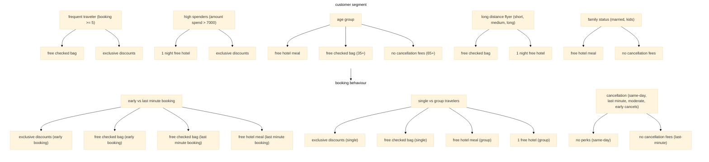
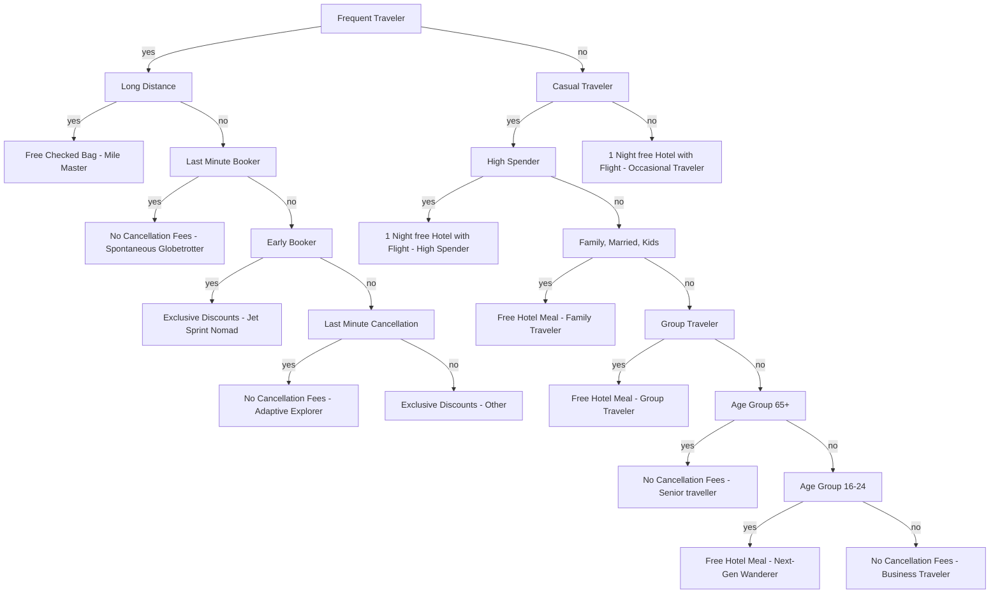

## TravelTide Mastery Project

This project uses TravelTide customer data to create business-relevant segments and deliver data-driven recommendations based on the insights you find.

## Introduction

TravelTide is a fast-growing e-booking startup and a relatively new entrant in the online travel market. Since launching near the end of the COVID-19 pandemic (2021-04), it has expanded steadily, powered by best-in-class data aggregation and search technology. However, parts of the customer experience remain underdeveloped, leading to low retention. To address this, the next step is to plan and run a marketing campaign with a personalized rewards program designed to bring customers back to the TravelTide platform. Five perks will be assigned to customers:

- 🍽️ Free hotel meal
- 🧳 Free checked bag
- 🚫💸 No cancellation fees
- 🏷️ Exclusive discounts
- 🏨🌙✈️ 1 free hotel night with flight

## Planning

### Data overview

TravelTide provides four tables:

|            | flights    | hotels    | sessions    | users    |
|------------|------------|-----------|-------------|----------|
| Key        | trip_id    | trip_id   | session_id  | user_id  |
| dim/fact   | fact       | fact      | fact        | dim      |
| # columns  | 1,901,038  | 1,918,617 | 5,408,063   | 1,020,926|
| # rows     | 13         | 7         | 13          | 11       |

- **Users:** user-level information (e.g., demographic attributes).
- **Sessions:** session activity and behavior (e.g., clicks, session ID, booking and cancellation details).
- **Flights:** flight-related details (e.g., departure/arrival dates, home/destination airports, checked bags).
- **Hotels:** hotel-related details (e.g., property name/location, check-in/check-out dates, number of rooms).

### Workflow: assigning a personalized perk

1. **Identify active users:** filter for users with more than 7 sessions since January 4, 2023; reduce the dataset from 5M+ sessions to 5,998 active users.
2. **Explore the data:** analyze patterns and define customer groups that can be matched to the most relevant perk.



Rule Set for User Group Creation

| Segment | Characteristic |
| --- | --- |
| Age Group | 16–24, 25–34, 35–44, 45–54, 55–64, 65+ |
| Travel Frequency | frequent traveler (>= 5 bookings), casual traveler (2–4 bookings), low-frequent traveller (1 booking) |
| Spend | High spender (total cost > 7000 USD) |
| Flight Distance | short-haul-flyer (avg < 500 miles), medium-haul-flyer (avg 500–2500 miles), long-haul-flyer (avg > 2500 miles) |
| Booking Time | Last minute booker (< 7 days), Early booker (7–60 days), Moderate early booker (60–180 days), Super early booker (> 180 days) |
| Cancellation | Same-Day Cancellers, Last-Minute Cancellers (1–7 days), Moderate Cancellers (8–30 days), Early Cancellers (30+ days), No Cancellation |
| Travel Party | Solo traveler, Family/Group traveler, Solo and group traveler |
| Family | married, children, not married, children, married, no children, not married, no children |

### 3. Additional calculations and data preparation

- **Re-calculated** hotel nights while excluding time-based NULL values (these appear only in cancellation sessions where `hotel_booked = false`).
- **Age:** calculated from `birthdate` and `session_end`.
- **Time since signup:** calculated as the difference between `sign_up_date` and `session_end`.
- **Stay duration:** calculated in hours using either `return_time - departure_time` (flights) or `check_out_time - check_in_time` (hotels).
- Linked cancellation information to the correct `session_id`.
- **Average days to cancellation:** calculated from the cancelled session’s `session_end` and the `session_start`.
- **Average session duration:** calculated as `session_end - session_start`.
- **Flight cost:** derived from `base_fare_usd`, adjusted for number of seats and `flight_discount_amount`.
- **Hotel cost:** derived from `hotel_per_room_usd`, adjusted for number of nights and `hotel_discount_amount`.
- **Average days to travel:** calculated as `(flight_departure OR hotel_check_in) - session_end`.
- **Travel party:** recoded `travel_party` (1 = solo, >1 = group/family).
- **Average distance (miles):** computed from home and destination airport latitude/longitude using the Haversine formula.

### 4. Decision tree and customer group assignment



### 5. Segmentation of customers into groups After analysis: 10 groups have been built


Others include all travelers who could not be assigned to a specific group Metrics used for building the groups: session behaviour, trip behaviour, demographics

### 6. Perk Assignment

| Customer Group | Perk | Why It Matters |
|---|---|---|
| Mile Master (Long distance, frequent flyer) | Free Checked Bag | Encourages ongoing loyalty and reduces booking friction. |
| High Spenders (> 7000 USD on total trips) | Free Checked Bags, Hotel Nights with Flight | Reinforces a premium experience without appearing cheap |
| Spontaneous Globetrotter (Frequent Flyer, Last-Minute Booker) | No Cancellation Fees | Provides flexibility for spontaneous travelers |
| Jet Sprint Nomad (Frequent Flyer, Early Booker) | Real-Time Deals, Flexibility | Incentivizes advance planning |
| Group Traveler | Free Meals, Group Discounts | Larger groups appreciate accomodation perks |
| Family Traveler (Traveler has Children) | Free Meals, Group Discounts | Helps with family budgeting and convenience |
| Senior Traveler (age >=65) | No Cancellation Fees | Older travelers value flexibility |
| Adaptive Explorer (Frequent Flyer, Last-Minute Cancellations) | No Cancellation Fees | Supports Flexibility |
| Next-Gen Wanderer (age 16-24) | Free Hotel Meal | Young Travelers are Price Sensitive |
| Business Traveler (Middle-Aged, Solo Traveler) | No Cancellation Fees | Business travelers value flexibility |


## SQL code used in BeeKeeper for creating CSV file for upload into Tableau


````sql
/*filter for sessions starting after 2023-01-04 and data corrections*/

with session_filtered as (
     select *
     from sessions
     where session_start > '2023-01-04'
  ), 
  

/* creating user filter*/
  user_filter as (
      select user_id, count(*)
      from session_filtered
      group by user_id
      having count(*) > 7
  ),
  
 
/* Main session base table with re-calculations and additional calculations */    
  session_base as (
      select *, 
      
     /* recalculate night*/
      
      case when hotel_booked is true and cancellation is false and date(check_out_time) > date(check_in_time) then   
              (date(check_out_time) - date(check_in_time) )
         when hotel_booked is true and cancellation is false and date(check_out_time) < date(check_in_time) and return_time is not NULL 
               then (date(return_time) - date(check_in_time) )
         when hotel_booked is true and cancellation is true then NULL
         when hotel_booked is true and cancellation is false and date(check_out_time) = date(check_in_time) and return_time is not NULL 
              then (date(return_time) - date(check_in_time))
         when hotel_booked is true and cancellation is false and date(check_out_time) = date(check_in_time) and return_time is NULL 
              then 1
         when hotel_booked is false then NULL
              else 99999
     end 
     as nights_new,
    
    /* family vs single */
     case
         when  (seats >= 2 or rooms  > 1) then 100    /*family/group*/
         when  (seats = 1 or rooms  = 1) then 1      /*solo*/
         else 0
     end as travel_party, 
     
    
    /*plit hotel_name to name and location*/
     split_part(hotel_name,'-',1) as hotel,
     split_part(hotel_name,'-', 2) as hotel_location
      
     from session_filtered s
     left join users using(user_id)
     left join flights using(trip_id)
     left join hotels using(trip_id)
     where user_id in (select user_id from user_filter)
     order by user_id, session_id
  ),
  
 
  /* this CTE selects the cancelled trips */
  
  cancellation as(
     select trip_id as canc_trip_id, user_id as canc_user_id, page_clicks as canc_page_clicks, session_start as canc_session_start, session_end as canc_session_end, 
            cancellation as canc_cancellation, session_id as canc_session_id
     from session_base
     where cancellation=true
     ),
     
     
 cancelled_trips as (
   select distinct trip_id
   from session_base
   where cancellation is true
),

 not_cancelled_trips as (
     select * 
     from session_base
     where trip_id not in (select trip_id from cancelled_trips)
 ),
 
   
     
/* re-join with session_base */
   session_base_canc as  (
     select *, 
            case when (cancellation =true) then 'not select'
              else 'select'
             end  as analysis,
     
            /*plit hotel_name to name and location*/
            split_part(hotel_name,'-',1) as hotel,
            split_part(hotel_name,'-', 2) as hotel_location
       
     from session_base s
     left join cancellation c on s.trip_id = c.canc_trip_id
   ),
     
 /* cte for user_trip based */    
 user_trips as (
   select user_id,
   
          /*nights*/
          avg(nights) as avg_nights_new,
   
          /*rooms*/
          avg(rooms) as avg_rooms,
   
          /*checked bags */
          avg(checked_bags) as avg_checked_bags,
   
          /* travel frequency*/
          count(distinct trip_id) as number_trips,
          case when count(distinct trip_id) >= 5 then 'Frequent Traveler' 
               when count(distinct trip_id ) > 1 and count(distinct trip_id ) < 5 then 'Casual Traveler'
               when count(distinct trip_id) = 1  then 'Low Freqent Traveler'
          /*when count(distinct trip_id) = 0 then 'nothing booked'*/
          else Null
          end as segment_travel_frequency,
   
          /* average duration stay*/
          coalesce(avg(round(EXTRACT(EPOCH FROM (return_time - departure_time)) / 3600,1)),avg(round(EXTRACT(EPOCH FROM (check_out_time - check_in_time)) / 3600,1)),0)
                   as avg_duration_stay,
   
          /*average distance miles and segment_flight_distance */
           AVG(haversine_distance( home_airport_lat, home_airport_lon, destination_airport_lat, destination_airport_lon)*0.621371::float) AS avg_distance_miles,
   
           CASE  
             WHEN AVG(haversine_distance( home_airport_lat, home_airport_lon, destination_airport_lat, destination_airport_lon)*0.621371::float) >=1 and 
                  AVG(haversine_distance( home_airport_lat, home_airport_lon, destination_airport_lat, destination_airport_lon)*0.621371::float) <= 500 THEN 'Short-Haul Flyer (<500 miles)'
             WHEN AVG(haversine_distance( home_airport_lat, home_airport_lon, destination_airport_lat, destination_airport_lon)*0.621371::float) > 500  
                  AND AVG(haversine_distance( home_airport_lat, home_airport_lon, destination_airport_lat, destination_airport_lon)*0.621371::float) <= 2000 THEN 'Medium-Haul Flyer (500-2000 miles)'
             WHEN AVG(haversine_distance( home_airport_lat, home_airport_lon, destination_airport_lat, destination_airport_lon)*0.621371::float) > 2000 THEN 'Long-Haul Flyer (>2000 miles)'
             ELSE 'Unknown'
            END as segment_flight_distance,
     
           /* hotel costs*/
           COALESCE(SUM((hotel_per_room_usd * nights_new * rooms) * (1 - COALESCE(hotel_discount_amount, 0))), 0) AS cost_hotel,

          /* flight costs */
          COALESCE(SUM((base_fare_usd * seats) * (1 - COALESCE(flight_discount_amount, 0))), 0) AS cost_flight,
   
          /* total costs */
          COALESCE(SUM((hotel_per_room_usd * nights_new * rooms) * (1 - COALESCE(hotel_discount_amount, 0))), 0)
                + COALESCE(SUM((base_fare_usd * seats) * (1 - COALESCE(flight_discount_amount, 0))), 0)  
          as total_costs,
     
          /* segment_spend*/
          
          case when COALESCE(SUM((hotel_per_room_usd * nights_new * rooms) * (1 - COALESCE(hotel_discount_amount, 0))), 0)
                + COALESCE(SUM((base_fare_usd * seats) * (1 - COALESCE(flight_discount_amount, 0))), 0)  
                > 7000 then 'High Spender'
          else NULL
          end as segment_spend,
   
          
          /*days to travel*/
          coalesce(avg(date_part('day', departure_time - session_end)),avg(date_part('day', check_in_time - session_end)), 0) as avg_days_to_travel,
     
          case
            when coalesce(avg(date_part('day', departure_time - session_end)),avg(date_part('day', check_in_time - session_end)), 0) > 1 and 
                 coalesce(avg(date_part('day', departure_time - session_end)),avg(date_part('day', check_in_time - session_end)), 0) < 8 then 'Last Minute Booker'
            when coalesce(avg(date_part('day', departure_time - session_end)),avg(date_part('day', check_in_time - session_end)), 0) >= 8 and 
                 coalesce(avg(date_part('day', departure_time - session_end)),avg(date_part('day', check_in_time - session_end)), 0) < 61 then 'Early Booker'
            when coalesce(avg(date_part('day', departure_time - session_end)),avg(date_part('day', check_in_time - session_end)), 0) >= 61 and 
                 coalesce(avg(date_part('day', departure_time - session_end)),avg(date_part('day', check_in_time - session_end)), 0) < 180 then 'Moderate Early Booker'
            when coalesce(avg(date_part('day', departure_time - session_end)),avg(date_part('day', check_in_time - session_end)), 0) >= 180 then 'Super Early Booker'
            else 'unknown'
          end as segment_booking_time
     
   from not_cancelled_trips
   group by user_id
  ),   
     
    /**/
    /*user-based                                                        */
    /**/
  
  /*colums from users */
  user_users as (
  select user_id, gender, home_country, home_city, home_airport, married, has_children,
         DATE_PART('year', AGE((select max(session_end)
                  from session_filtered
                  where user_id in (select user_id from user_filter))
            , birthdate)) AS age,
    
         /* age_groups*/
         CASE 
            WHEN  DATE_PART('year', AGE((select max(session_end)
                  from session_filtered
                  where user_id in (select user_id from user_filter))
            , birthdate)) < 25 THEN '16-24'
            WHEN  DATE_PART('year', AGE((select max(session_end)
                  from session_filtered
                  where user_id in (select user_id from user_filter))
            , birthdate)) BETWEEN 25 AND 34 THEN '25-34'
            WHEN  DATE_PART('year', AGE((select max(session_end)
                  from session_filtered
                  where user_id in (select user_id from user_filter))
            , birthdate)) BETWEEN 35 AND 44 THEN '35-44'
            WHEN  DATE_PART('year', AGE((select max(session_end)
                  from session_filtered
                  where user_id in (select user_id from user_filter))
            , birthdate)) BETWEEN 45 AND 54 THEN '45-54'
            WHEN  DATE_PART('year', AGE((select max(session_end)
                  from session_filtered
                  where user_id in (select user_id from user_filter))
            , birthdate)) between 55 and 64 then '55-64'
            when  DATE_PART('year', AGE((select max(session_end)
                  from session_filtered
                  where user_id in (select user_id from user_filter))
            , birthdate)) > 65 then '65+'
            ELSE 'Unknown'
        END AS segment_age_group,
    
         case 
          when( married is true and has_children is true) then 'married, children'
          when( married is true and has_children is false) then 'married, no children'
          when( married is false and has_children is true) then 'not married, children'
          when(married is false and has_children is false) then 'not married, no children'
          else 'missing'   
       end as segment_family
  
  from users
    
  ),
  
    
    
  
/* columns from session_base_canc*/ 
  
   user_based_session as (
   select user_id, 
     
      /* canc_page_clicks*/
      sum(canc_page_clicks) as sum_canc_page_clicks,
     
      /* page_clicks */
      sum(page_clicks) as sum_page_clicks,
     
      /*session number*/
      COUNT(DISTINCT session_id) AS number_sessions, 
     
      /* canc_session_number */
      count(distinct canc_session_id) as canc_number_session,

      /*session duration*/
      avg(date_part('minute',session_end - session_start)) as avg_session_duration,
     
      avg(date_part('minute',canc_session_end - canc_session_start)) as avg_canc_session_duration,   
      
      /* time to cancellation */
      avg(DATE_PART('day', canc_session_end - session_start)) AS avg_days_to_cancellation,
   
      CASE  
        WHEN avg(DATE_PART('day', canc_session_end - session_start)) < 1 THEN 'Same-Day Cancellers'
        WHEN avg(DATE_PART('day', canc_session_end - session_start)) >= 1 AND 
             avg(DATE_PART('day', canc_session_end - session_start)) < 8 THEN 'Last-Minute Cancellers (1-7 days)'
        WHEN avg(DATE_PART('day', canc_session_end - session_start)) >= 8
             AND avg(DATE_PART('day', canc_session_end - session_start)) < 30  THEN 'Moderate Cancellers (8-30 days)'
        WHEN avg(DATE_PART('day', canc_session_end - session_start)) >= 30 THEN 'Early Cancellers (30+ days)'
        ELSE 'No Cancellation/nothing booked'
      END AS segment_cancellation,
    
    /* segment_travel_party*/
    case when sum(travel_party) between 1 and  99 then 'Solo traveler'
         when sum(travel_party) in (100,200,300,400,500,600,700,800,900) then 'Family/Group traveler'
         when sum(travel_party) > 100 then 'Solo and group traveler'
         when sum(travel_party) = 0 then 'nothing booked'
         else NULL
     end as segment_travel_party
     
   from session_base_canc
   
   group by user_id 
   
  ) ,
  
  user_based as (
    select * 
    from user_based_session
    left join user_users u using(user_id)
    left join user_trips using(user_id)
    
    
  ) ,
 /* assign perk to user_base dataset*/
 
user_based_perk as (
    select *, 
 
/*assign customer_group */  
   case
    when segment_travel_frequency = 'Frequent Traveler' and segment_flight_distance = 'Long-Haul Flyer (>2000 miles)' then 'Mile Master'
    when segment_travel_frequency = 'Frequent Traveler' and segment_flight_distance != 'Long-Haul Flyer (>2000 miles)' 
         and segment_booking_time = 'Last Minute Booker' then 'Spontaneous Globetrotter'
    
    when segment_travel_frequency = 'Frequent Traveler' and segment_flight_distance != 'Long-Haul Flyer (>2000 miles)' 
         and segment_booking_time != 'Last Minute Booker' and segment_booking_time = 'Early Booker' then 'Jet Sprint Nomad'
  
    when segment_travel_frequency = 'Frequent Traveler' and segment_flight_distance != 'Long-Haul Flyer (>2000 miles)' 
         and /*segment_booking_time != 'Last Minute Booker' and*/ segment_booking_time != 'Early Booker' 
         and segment_cancellation = 'Last-Minute Cancellers (1-7 days)' then 'Adaptive Explorer'
  
    when segment_travel_frequency = 'Frequent Traveler' and segment_flight_distance != 'Long-Haul Flyer (>2000 miles)' 
         and /*segment_booking_time != 'Last Minute Booker' and */segment_booking_time != 'Early Booker' 
         and segment_cancellation != 'Last-Minute Cancellers (1-7 days)' then 'Other'
    
    
    when segment_travel_frequency = 'Low Freqent Traveler' then 'Occasional Traveler' 
    when segment_travel_frequency != 'Frequent Traveler' and segment_travel_frequency != 'Low Freqent Traveler' and segment_spend ='High Spender' then 'High Spender'
    when segment_travel_frequency != 'Frequent Traveler' and segment_spend is NULL and segment_family in ( 'married, children','not married, children') then 'Family Traveler'
  
    when segment_travel_frequency != 'Frequent Traveler' and segment_travel_frequency != 'Low Freqent Traveler' 
         and segment_spend is NULL and segment_family not in  ( 'married, children','not married, children')
         and segment_travel_party='Family/Group traveler' then 'Group Traveler'
  
    when segment_travel_frequency != 'Frequent Traveler' and segment_travel_frequency != 'Low Freqent Traveler' 
         and segment_spend is NULL and segment_family not in  ( 'married, children','not married, children')
         and segment_travel_party != 'Family/Group traveler' 
         and segment_age_group = '65+' then 'Senior Traveler'
  
    when segment_travel_frequency != 'Frequent Traveler' and segment_travel_frequency != 'Low Freqent Traveler' 
         and segment_spend is NULL and segment_family not in  ( 'married, children','not married, children')
         and segment_travel_party != 'Family/Group traveler' 
         and segment_age_group != '65+' and segment_age_group = '16-24' then 'Next-Gen Wanderer'
  
    when segment_travel_frequency != 'Frequent Traveler' and segment_travel_frequency != 'Low Freqent Traveler' 
         and segment_spend is NULL and segment_family not in  ( 'married, children','not married, children')
         and segment_travel_party != 'Family/Group traveler' 
         and segment_age_group != '65+' and segment_age_group != '16-24' then 'Business Traveler'
     else 'Other'  end as customer_group,
    
  
  
    /* assign perks*/
    case
    when segment_travel_frequency = 'Frequent Traveler' and segment_flight_distance = 'Long-Haul Flyer (>2000 miles)' then 'Free Checked Bag'
    when segment_travel_frequency = 'Frequent Traveler' and segment_flight_distance != 'Long-Haul Flyer (>2000 miles)' 
         and segment_booking_time = 'Last Minute Booker' then 'No Cancellation Fees'
    
    when segment_travel_frequency = 'Frequent Traveler' and segment_flight_distance != 'Long-Haul Flyer (>2000 miles)' 
         and segment_booking_time != 'Last Minute Booker' and segment_booking_time = 'Early Booker' then 'Exclusive Discounts'
  
    when segment_travel_frequency = 'Frequent Traveler' and segment_flight_distance != 'Long-Haul Flyer (>2000 miles)' 
         and segment_booking_time != 'Last Minute Booker' and segment_booking_time != 'Early Booker' 
         and segment_cancellation = 'Last-Minute Cancellers (1-7 days)' then 'No Cancellation Fees'
  
    when segment_travel_frequency = 'Frequent Traveler' and segment_flight_distance != 'Long-Haul Flyer (>2000 miles)' 
         and segment_booking_time != 'Last Minute Booker' and segment_booking_time != 'Early Booker' 
         and segment_cancellation != 'Last-Minute Cancellers (1-7 days)' then 'Exclusive Discounts'
    
    
    when segment_travel_frequency = 'Low Freqent Traveler' then '1 Night free Hotel with Flight' 
    when segment_travel_frequency != 'Frequent Traveler' and segment_travel_frequency != 'Low Freqent Traveler' 
         and segment_spend ='High Spender' then '1 Night free Hotel with Flight'
    when segment_travel_frequency != 'Frequent Traveler' and segment_travel_frequency != 'Low Freqent Traveler' 
         and segment_spend is NULL and segment_family in ( 'married, children','not married, children') then 'Free Hotel Meal'
  
    when segment_travel_frequency != 'Frequent Traveler' and segment_travel_frequency != 'Low Freqent Traveler' 
         and segment_spend is NULL and segment_family  not in ( 'married, children','not married, children')
         and segment_travel_party='Family/Group traveler' then 'Free Hotel Meal'
  
    when segment_travel_frequency != 'Frequent Traveler' and segment_travel_frequency != 'Low Freqent Traveler' 
         and segment_spend is NULL and segment_family not in  ( 'married, children','not married, children')
         and segment_travel_party != 'Family/Group traveler' 
         and segment_age_group = '65+' then 'No Cancellation Fees'
  
    when segment_travel_frequency != 'Frequent Traveler' and segment_travel_frequency != 'Low Freqent Traveler' 
         and segment_spend is NULL and segment_family not in ( 'married, children','not married, children')
         and segment_travel_party != 'Family/Group traveler' 
         and segment_age_group != '65+' and segment_age_group = '16-24' then 'Free Hotel Meal'
  
    when segment_travel_frequency != 'Frequent Traveler' and segment_travel_frequency != 'Low Freqent Traveler' 
         and segment_spend is NULL and segment_family not in  ( 'married, children','not married, children')
         and segment_travel_party != 'Family/Group traveler' 
         and segment_age_group != '65+' and segment_age_group != '16-24' then 'No Cancellation Fees'
    else 'Exclusive Discounts' end as assigned_perk
   from user_based 
    )


  
  select *
  from user_based_perk
  
  ;
````

For CSV file klick: [hier](travel_tide.csv)


## Tableau Story Slides

.png)

.png)

.png)

.png)

.png)
Tableau workbook (interactive): [Open in Tableau Public](https://public.tableau.com/views/travel_tide_story/TravelTide?:language=en-US&:sid=&:redirect=auth&:display_count=n&:origin=viz_share_link)


